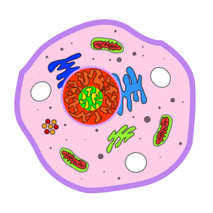
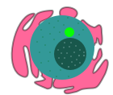

### Introduction

Cellular Conquest was a game I built for a friend's Connecticut Science Center exhibit from July-August, 2015. The point of the game was to serve as a very simple demonstration of a cell's defense system, particularly antibodies and proteasomes. It was intended to be played in a touchscreen (read: tablet/laptop) environment by all audiences.

> **NOTE:** This is a very barebones tech demo and by no means a final version. It was also my first attempt at using `pygame`, so there are likely lots of things I'm doing wrong. There are plenty of minor bugs, but nothing to render the game unplayable. The code is open sourced for both historical purposes but also to show how a beginner can approach `pygame` and develop something more sophisticated than demo code.

### How To Play

##### Dependencies

* pygame
	* http://www.pygame.org/download.shtml
	* For OS X Homebrew users:
		* `brew install pygame`

* Python 2.7+
	* Comes preinstalled on most Linux / OS X versions
	* https://www.python.org/downloads/

##### Running

In a console:
> python main.py

The default game resolution is `1280x800`. Depending on your screen resolution, you may need to change this. You can do so like this:

> python main.py 500 800

This will launch the game using a `500x800` resolution.

> **NOTE:** I realize now that resolution is probably the wrong term (should be window size), but that's what I called it when I wrote the code so I'll keep this here for clarity's sake.

##### Gameplay

Here's a screenshot:


The main goal of the game is to protect your
	
cell from
	
viruses. Viruses will continually spawn at random positions off the screen and head directly for your
	
nucleus. If any virus manages to touch it, you will lose the game.

###### Antibodies
One way to prevent this is by placing down
	
antibodies outside of the cell. Antibodies can't move, but they will slow down any virus that hits them. When a virus hits an antibody,
it will be
	
tagged. Tagging a virus will consume the antibody, but you have unlimited antibodies, so you just have to make sure you keep placing them down.

> **NOTE:** You don't necessarily have to tag viruses. It's just a good idea to help prevent any viruses from catching you off guard.

###### Proteasomes
When the game starts, you will be given three
	
proteasomes to command. If a virus touches a proteasome, it will be destroyed. To select a proteasome, simply tap/click on it. The proteasome graphic will change to
	
 . Then, tap on a different location. The proteasome will begin moving to that position and stop once it reaches it. Note that a proteasome is an internal part of the cell, and therefore it cannot move past the cell's wall. You will have to be strategic with your movements!

###### Winning

You can't! In real life, the cellular conquest never ends :)

When you lose, the game will tell you how many seconds you lasted, so if you want you can try to beat your previous record.

### Image Resources

The original version of Cellular Conquest used random graphics taken from Google Images. Obviously, those aren't really distributable, so I got my good friend
	
[Andrew Aabosh](http://andrew-abosh.com/) to recreate them. The images you see in the `res` folder were all made by him. Thanks, Andrew!

### Next Steps

This project was left alone once it fulfilled its purpose as a tech demo. That being said, there are plenty of ideas that could be implemented, and many bugs that can be squashed.

##### Ideas

* Customizable amount of proteasomes
* Limited antibodies
* Levels/waves
* Difficult selector which modifies entity speeds
* Automatic resolution picker
* Polished start and end screens
* Multiple lives
* DOCUMENTATION! A lot of the code (especially that in `BaseClasses.py`) served more as a framework to extend `pygame` rather than game-specific logic. If documented, it could maybe help out others struggling to implement functionality `pygame` doesn't have.

##### Bugs

* No idea what this is.
	```
	2016-08-14 07:55:36.759 Python[17778:610990] 07:55:36.758 WARNING:  140: This application, or a library it uses, is using the deprecated Carbon Component Manager for hosting Audio Units. Support for this will be removed in a future release. Also, this makes the host incompatible with version 3 audio units. Please transition to the API's in AudioComponent.h.
	```

* Sometimes, when you tell a proteasome to move somewhere, it will get deselected but won't move to the desired location.
* In addition, proteasomes can sometimes freak out once they reached their location and repeatedly move back-and-forth in place. This is likely caused by the navigation code failing to detect that the proteasome has reached its location.
* When you close the window, weird graphical artifacts appear in the window for a few milliseconds until the window finally closes. While not a big deal, this might be indicative of a larger problem (such as objects failing to be de-initialized, which can lead to memory overflows).
* Probably some other stuff I missed.

### License

```
MIT License

Copyright (c) 2015 Andi Andreas

Permission is hereby granted, free of charge, to any person obtaining a copy
of this software and associated documentation files (the "Software"), to deal
in the Software without restriction, including without limitation the rights
to use, copy, modify, merge, publish, distribute, sublicense, and/or sell
copies of the Software, and to permit persons to whom the Software is
furnished to do so, subject to the following conditions:

The above copyright notice and this permission notice shall be included in all
copies or substantial portions of the Software.

THE SOFTWARE IS PROVIDED "AS IS", WITHOUT WARRANTY OF ANY KIND, EXPRESS OR
IMPLIED, INCLUDING BUT NOT LIMITED TO THE WARRANTIES OF MERCHANTABILITY,
FITNESS FOR A PARTICULAR PURPOSE AND NONINFRINGEMENT. IN NO EVENT SHALL THE
AUTHORS OR COPYRIGHT HOLDERS BE LIABLE FOR ANY CLAIM, DAMAGES OR OTHER
LIABILITY, WHETHER IN AN ACTION OF CONTRACT, TORT OR OTHERWISE, ARISING FROM,
OUT OF OR IN CONNECTION WITH THE SOFTWARE OR THE USE OR OTHER DEALINGS IN THE
SOFTWARE.
```
