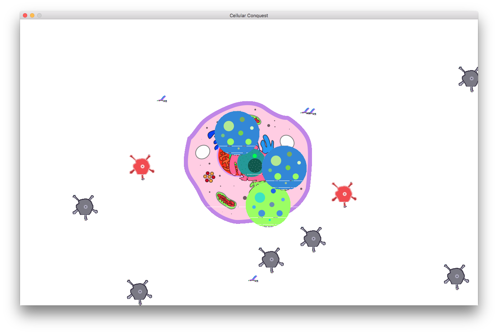

### Introduction

Cellular Conquest was a game I built for a friend's Connecticut Science Center exhibit. The point of the game was to serve as a very simple demonstration of a cell's defense system, particularly antibodies and proteasomes. It was intended to be played in a touchscreen (read: tablet/laptop) environment by all audiences.

> **NOTE:** This is a very barebones tech demo and by no means a final version. It was also my first attempt at using `pygame`, so there are likely lots of things I'm doing wrong. There are plenty of minor bugs, but nothing to render the game unplayable. The code is open sourced for both historical purposes but also to show how a beginner can approach `pygame` and develop something more sophisticated than demo code.

### How To Play

##### Dependencies

* pygame
	* http://www.pygame.org/download.shtml
	* For OS X Homebrew users:
		* `brew install pygame`

* Python 2.7+
	* Comes preinstalled on most Linux / OS X versions
	* https://www.python.org/downloads/

##### Running

The default game resolution is `1280x800`. Depending on your screen resolution, you may need to change this. You can do so in line 8.
TODO

In a console:
> python main.py

##### Gameplay

Here's a screenshot:

The main goal of the game is to protect your
	
cell from
	
viruses. Viruses will continually spawn at random positions off the screen and head directly for your
	
nucleus. If any virus manages to touch it, you will lose the game.

###### Antibodies
One way to prevent this is by placing down
	
antibodies outside of the cell. Antibodies can't move, but they will slow down any virus that hits them. When a virus hits an antibody,
it will be
	
tagged. Tagging a virus will consume the antibody, but you have unlimited antibodies, so you just have to make sure you keep placing them down.

> **NOTE:** You don't necessarily have to tag viruses. It's just a good idea to help prevent any viruses from catching you off guard.

###### Proteasomes
When the game starts, you will be given three
	
proteasomes to command. If a virus touches a proteasome, it will be destroyed. To select a proteasome, simply tap/click on it. The proteasome graphic will change to
	
 . Then, tap on a different location. The proteasome will begin moving to that position and stop once it reaches it. Note that a proteasome is an internal part of the cell, and therefore it cannot move past the cell's wall. You will have to be strategic with your movements!

###### Winning

You can't! In real life, the cellular conquest never ends :)

When you lose, the game will tell you how many seconds you lasted, so if you want you can try to beat your previous record.

### Image Resources

### Next Steps

2016-08-14 07:55:36.759 Python[17778:610990] 07:55:36.758 WARNING:  140: This application, or a library it uses, is using the deprecated Carbon Component Manager for hosting Audio Units. Support for this will be removed in a future release. Also, this makes the host incompatible with version 3 audio units. Please transition to the API's in AudioComponent.h.

### License
